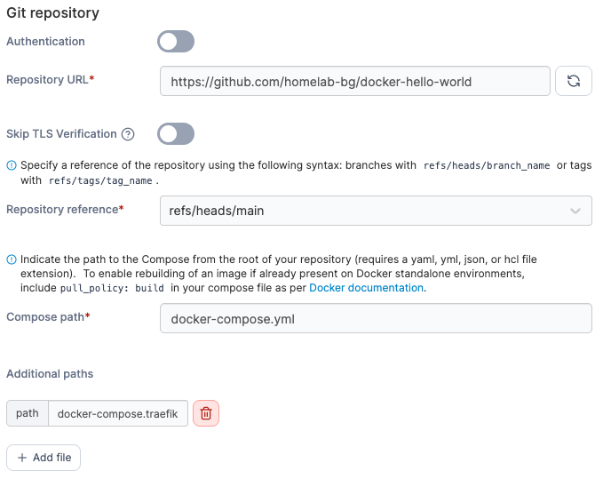

# Traefik Hello World

A simple Nginx service with support for both standalone and Traefik reverse proxy deployments.

## Quick Start

1. Copy environment template:
```bash
cp .env.example .env
```

2. Edit `.env` and configure your domain:
```bash
NGINX_HOST=hello.example.com
NGINX_PORT=80
```

## Deployment Options

### Standalone Deployment
Direct access via host ports:
```bash
docker compose up -d
```
Access at: http://localhost:80 (or configured NGINX_PORT)

### Traefik Integration
Deploy with reverse proxy integration:
```bash
docker compose -f docker-compose.yml -f docker-compose.traefik.yml up -d
```
Access at: https://your-domain (with automatic TLS)

## Portainer Deployment

When deploying from GitHub in Portainer:

1. **Compose path**: `docker-compose.yml`
2. **Additional paths**: Click "Add file" and enter `docker-compose.traefik.yml`



This configures Portainer to merge both files, equivalent to:
```bash
docker compose -f docker-compose.yml -f docker-compose.traefik.yml up -d
```

## Prerequisites

### Standalone
- Docker & Docker Compose

### Traefik Integration  
- Docker & Docker Compose
- External `traefik` network
- Traefik instance with Let's Encrypt configured

## Configuration

See `.env.example` for available environment variables.

## Access

Service will be available at the configured `NGINX_HOST` domain with automatic TLS via Let's Encrypt.